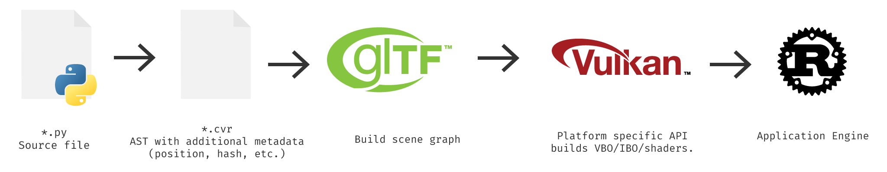

![Cover Image][screenshot-1]

# Code VR

[![License][license-img]][license-url]
[![Unit Tests][travis-img]][travis-url]
[![Coverage Tests][codecov-img]][codecov-url]

Code VR is a **free** *virtual reality* game for programming, designed to teach beginners the fundamentals of programming, let intermediate/advanced developers to compete in daily programming competitions, explore existing codebases as if they were a real place, and collaborate with other programmers whether they're on their favorite Text Editor/IDE or in the game.

Currently it only supports **Python**, but we plan on adding support for more languages in the future.

| | Screenshots  | |
|:--:|:--:|:--:|
| ![][screenshot-1] | ![][screenshot-2] | ![][screenshot-3] |

## Architecture

Code VR is built on top of **Rust**, **Vulkan**, **OpenVR**, and **Language Servers**.

The application is divided into the main application that handles rendering/networking/gameplay/mods, a language server that conforms to the [Language Server Protocol Spec](https://github.com/Microsoft/language-server-protocol), and a Language VR Server to send language specific VR metadata along side the language server.

### Data Flow

A set of source files are first converted to an abstract syntax tree, and then traversed to determine their position/relations to one another. This results in a `.cvr` file. This file is then converted to a GLTF scene graph at runtime, which is rendered by our Vulkan rendering engine, and the application takes over to allow for changes in the scene and writing those changes to the coresponding `.py` and `.cvr` files.

## Sponsors

This project was sponsored by the [OpenHID Lab](http://openhid.com), an *HCI research lab* part of the [High Performance Database Research Center](http://hpdrc.fiu.edu/) at Florida International University.

[screenshot-1]: docs/images/screenshots/0.png
[screenshot-2]: docs/images/screenshots/1.png
[screenshot-3]: docs/images/screenshots/2.png

[license-img]: http://img.shields.io/:license-mit-blue.svg?style=flat-square
[license-url]: https://opensource.org/licenses/MIT
[travis-img]: https://img.shields.io/travis/alaingalvan/code-vr.svg?style=flat-square
[travis-url]:https://travis-ci.org/alaingalvan/code-vr
[codecov-img]:https://img.shields.io/codecov/c/github/alaingalvan/code-vr.svg?style=flat-square
[codecov-url]: https://codecov.io/gh/alaingalvan/code-vr